# Recipe Share

### [View the live page here](https://recipe-share-58fcaea24fd7.herokuapp.com/)

Recipe Share is a Django web application created for people who enjoy sharing their most loved recipes and discovering new recipes that other users may have added. The web application offers users the option of creating their own recipes that can be shared on the site, other users may have the option to like and comment on recipe posts and visa versa. Sign up today and start exploring and sharing, discovering and trying recipes to your hearts content.

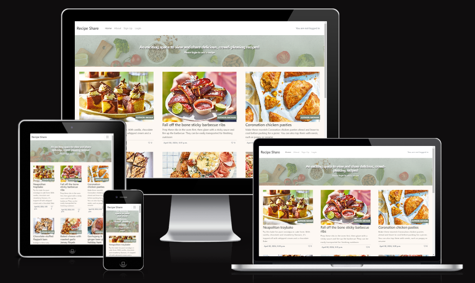

## User Experience (UX)

### Project Goals
The project goal is to create a user-friendly, responsive web application with seamless navigation to each page and from one recipe post to another as well as user feedback. The webpage allows visitors to explore recipes that have been posted by the site admin as well as other users, read more about the page as well as submit a contact form if they so wish to be contacted or contribute to the webpage in any way. Logged in users will have access to these options as well as the ability to add, update and delete their own recipes and like other recipes posted on the page.

### Agile Methodology
Epics were created to break down and group user stories which were then further broken down into tasks as steps to follow in the building process of the webpage. These were added to Project Boards on Github to assist with better organization and prioritization of the tasks in creating the webpage. 

 User Story Template

 User Story Issues

 Project Board

### User Stories

Detailed view of the [project board](https://github.com/users/NicoleJackson89/projects/3/views/1)

#### Epics:
1. User Experience as a New User / Visitor 
2. User Experience with Comments and Recipe posts
3. User Profile
4. Administration and Content Management

#### User Stories:
1. User Experience as a New User / Visitor 
    - Visually pleasing and easy to understand home page
    - Easy to navigate web page
    - New User account registration
    - Notifications pop-up to the User
2. User Experience with Comments and Recipe posts
    - View paginated list of Recipe posts
    - View Recipe posts
    - Add and manage Recipe posts
    - Comments on Recipes posted
3. User Profile
    - My Profile
    - Other users profiles
4. Administration and Content Management
    - Superuser/Admin control over other user accounts

### Target Audience
Recipe Share is designed for food lovers who:
- Enjoy sharing their cooking experiences
- Interested in exploring new recipe ideas
- Seek to network with others who have uploaded recipes
- First time cooks or people who prefer a guided cooking experience

### As a first time visitor
- Quickly and easily understand what the webpage is about.
- Navigate the main menu and options available easily.
- Informative content and easy to follow navigation between pages.
- Easily sign up to allow sharing of my own recipes and commenting on other recipe posts.
- Get notifications for actions performed throughout the page.
- Other users comments are visible to all users of the site.

### As a returning / logged in user
- Easily navigate through the webpage and recipe posts from the home page.
- Add a recipe post with easy, also the benefit of customization of text on some fields when adding a recipe.
- Recipes show likes on the home page as well as a short description of what the recipe is entails.
- Recipes are well laid out for easy understanding on the detail view as well as the adding a recipe view.
- Users can edit and delete recipes they have posted.
- Notifications are made visible when changes are successful.
- Users can comment on posts, edit and delete is also available if the comment was created by them.
- Other users comments are visible to all users of the site.

### As an admin user
- There is a secure login separate from the main webpage for administrators.
- Admin users have full CRUD on the about page, contact requests are made visible here too.
- User accounts can be accessed, edited and deleted here.
- Full CRUD is available on the recipe posts and comments to the admin.

## Design (UX)
Recipe Share was designed to have a welcoming easy to navigate and easy to understand layout. Natural earthy colors were used to allow the recipe post images to stand out and invite the users in. Nine recipe posts were made available on each page with the option to add a recipe to logged in users on the hero image on the home page. Social media links are available to each page for users to be redirected if they wished to see more about the Recipe Share webpage.

### Color Scheme

### Wireframes

 Home Page as a Guest / Visitor

- The search and filter by buttons which are visible below the webpage main heading on the home page for both visitors and users are a future feature to be implemented.
- Star ratings which would be visible to visitors and logged in users are also a future feature to be implemented

 Home Page as a Logged in User

 Sign Up Page

 Login Page

 About Page

 Contact Page

- Contact has been added to the about page and is visible below the "About" information.
- As a future feature the "Contact" page can be implemented in the nav bar.

 Profile Page

- The My Profile page would be visible to logged in users, there will be full CRUD on this future feature.

 Logout Page

 Recipe Detail Page

- The option to post a star rating out of 5 will be implemented as a future feature in the comments section on the recipe detail.

 Add Recipe Page

- As another future feature, logged in users will have the option to save the recipe post to allow them to continue editing the post at a later stage

### Database Models

1. AllAuth User Model
    - The Django built AllAuth is used as a default User model and provides user authentication.
    - Pre-defined fields of username, email and password are used.
    - The User is a one-to-many relationship with the Recipe model. 
2. Recipe Model
    - The Recipe model was created for visitors to view recipes and logged in users to add a recipe to the webpage, with a one-to-many relationship as one user can add many recipes to the webpage.
    - Fields a user may have access to when adding a recipe are: title, excerpt, featured image, prep & cook time, servings, ingredients, instructions and notes.
    - Automatic fields are: slug which is populated by the title, author which is related to the logged in user, created & updated on.
    - The likes field, a many-to-many relationship was an addition to allow users to like a recipe which is made visible to other users below each recipe as well as on the home page.
    - Recipe model has full CRUD functionality to the user
3. Comment Model
    - The Comment Model was created for logged in users to post a comment if they wish on a recipe, with a many-to-one relationship as many comments can be posted on one recipe.
    - Users see comments posted by other users on recipe posts, date, time and who posted the comment is visible to users in the comment section.
    - Comment model has full CRUD functionality to the user
4. Recipe Likes
    - The Recipe Likes Model was created for users to show interest in recipes posted on the webpage, with a many-to-one relationship with the User &Recipe Models as many likes can be made on one recipe.
    - Users are able to remove a like if they wish to do so.
5. About Model
    - The About Model was created for users of the webpage to get to know more about the site.
    - Fields include a featured image, updated on, title and body.
    - The fields can only be populated by the site admin with full CRUD functionality.
6. Contact Model
    - The Contact Model was created for visitors / logged in users to populate their info ie. name, email, contact number and message.
    - This information gets send to the admin section where there is full CRUD available on the form info sent as well as an option to mark it as "read".

 Database Diagram - Entity Relationship Diagram (ERD)

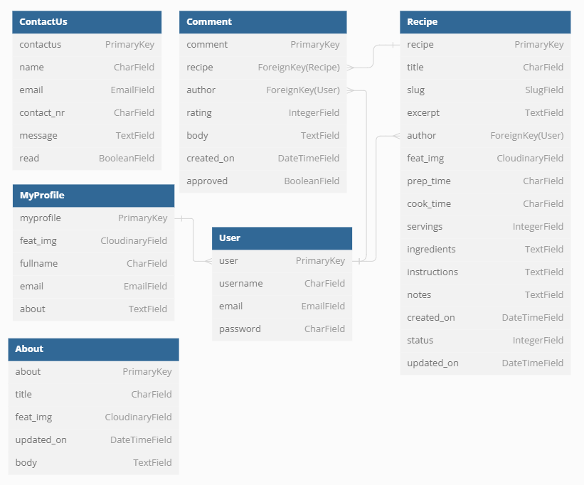

### Custom Error Pages
Error pages have a redirect to the home page button for better user experience
- 404 Page Not Found Error
- 500 Internal Server Error  

### Recipe details & Images
All recipes, details and images were taken from [BBC Good Food](https://www.bbcgoodfood.com/) 

### Fonts
The standard simple and easy to read Roboto & Lato fonts were used throughout this webpage as a user will be doing a lot of reading when following along with a recipe.

## Features

- The features on the webpage were designed to be user friendly, easy to navigate and understand while keeping in mind that users may view or make use of the site on different devices. 
- Full CRUD was implemented on both the comments as well as adding a recipe option for logged in users.
- All buttons throughout the webpage are interactive and change color when overed over.
- Full CRUD is available in teh admin panel for super users and allocated admin on comments, recipe posts and registered user accounts.

### Existing Features

 Home Page

Visitor
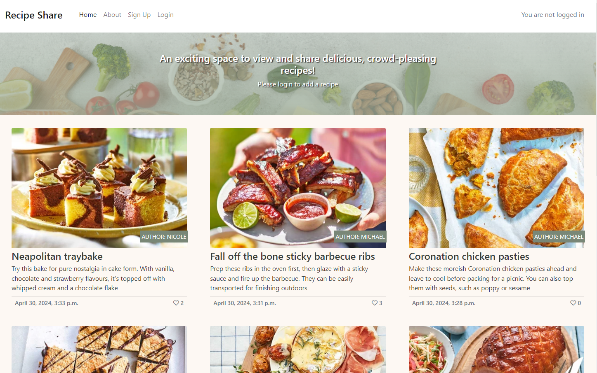
Logged in User
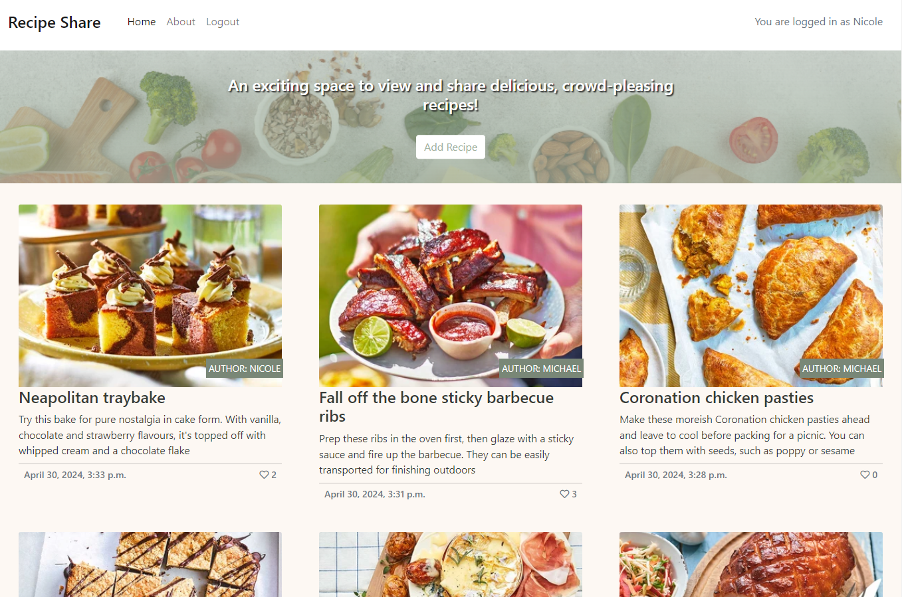
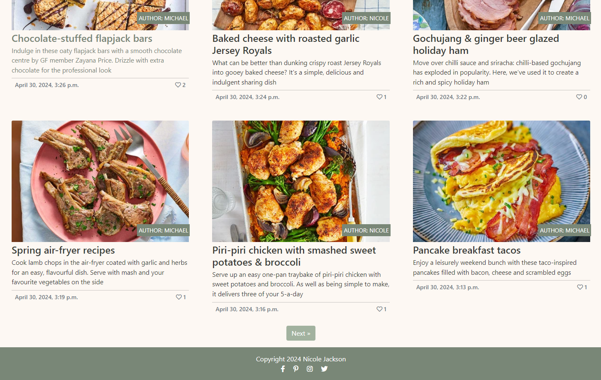

- The home page consists of a total of nine recipe posts where the uer will have an option to be directed to the next/prev page to view more recipe posts on the webpage.
- The next/prev button will be available to both logged in users and visitors.
- All recipes will be displayed to the users / visitors from newest to oldest on the main page.
- Recipes on the main page show the author name, number of likes as well as the published date stamp.

 Navigation

Visitor
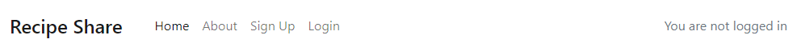
Logged in User
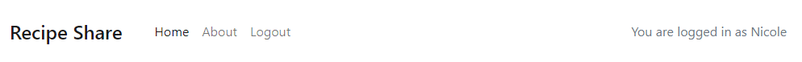

- Webpage name "Recipe Share" redirects to the home page when clicked for easy navigation.
- Active pages will show as "darker" text on the nav bar for better user experience.
- The nav bar consists of the home, about and login/logout/sign-up options as well as the current logged in users name.

 Main heading

Visitor

Logged in User

- The main heading has the "add recipe" button for logged in users to easily navigate to add a recipe.
- Notification to notify the user is not logged in stating to log in if the user wishes to add a recipe to the webpage.

 Add Recipe Page

Logged in User
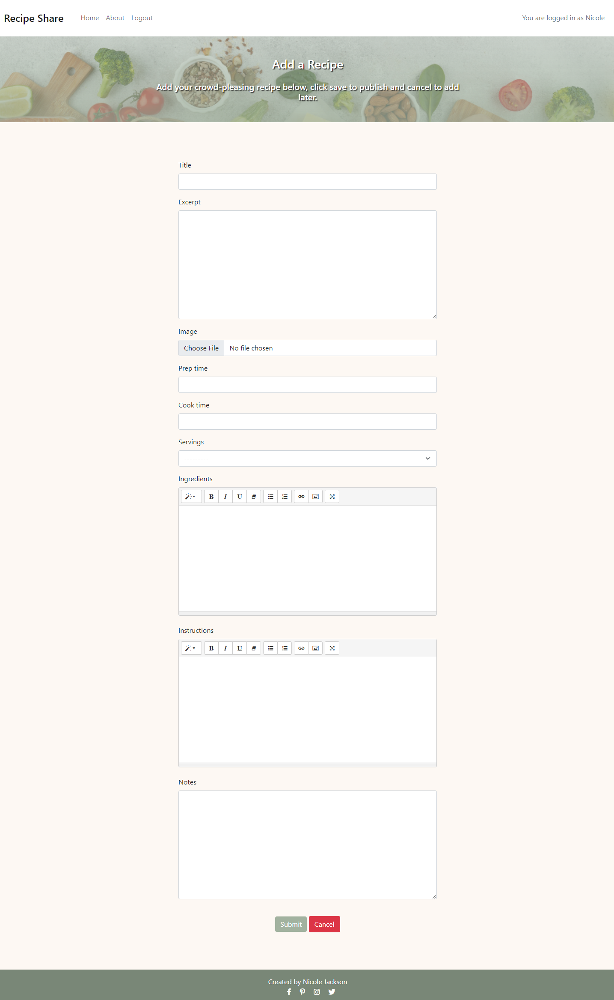

- The "Add Recipe" page will only be available for logged in users.
- The user has the option to add:
    -   Recipe title
    -   Excerpt (Short description of the recipe)
    -   Featured image
    -   Prep, cooking time and number of servings 1-6
    -   Ingredients and Instructions were added with more customizable text which gives a better view in the recipe detail and better user experience
    - Notes section if there were any optional extras to the recipe etc.
    - The recipe can be submitted which would publish it or canceled, clicking either button will redirect the user to the home page.
    - The user will be prompted with a success message after the recipe has been submitted.

 About / Contact Page

Logged in User / Visitor
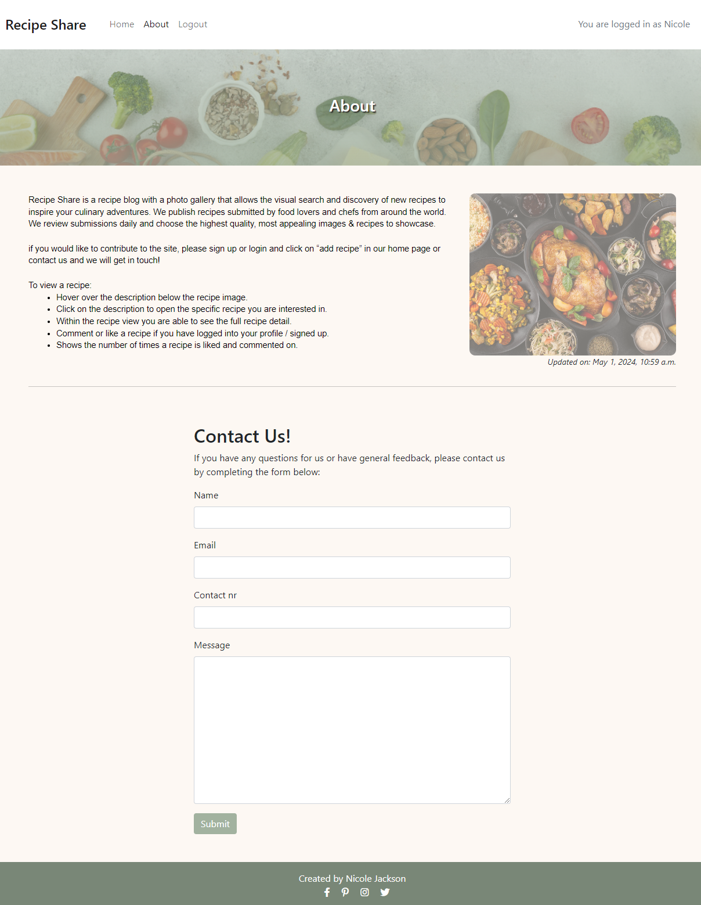

-  As a logged in user / visitor the about and contact page is available to get a better idea of what the webpage is about as well as submit a contact form if they which to be contacted.
- The contact form will be accessible to the admin in the admin panel.
- The user / visitor has fields of Name, Email, Contact number and message to fill out, all of which are required fields. 
-  After submitting the form the user will be prompted with a success message and redirected back to the About page.

 Recipe Detail page

Visitor
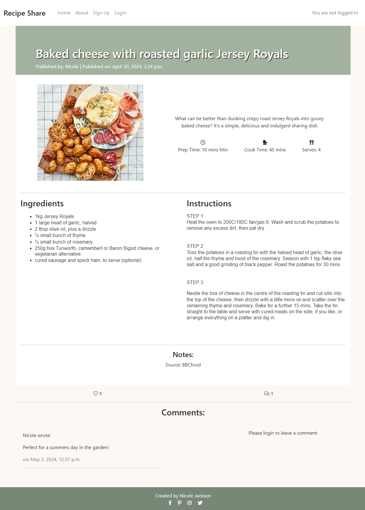
Logged in User
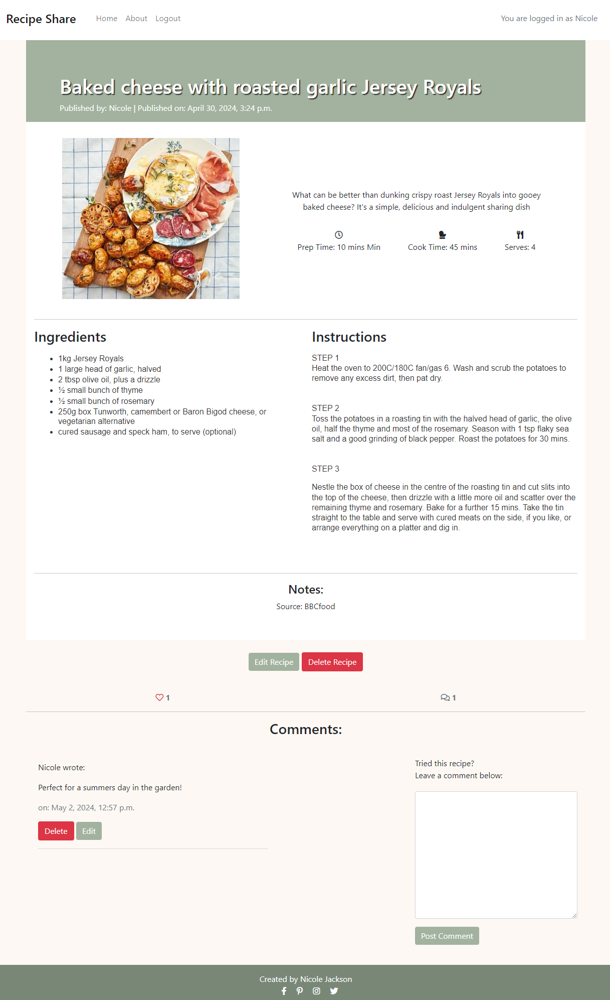

-  The recipe detail page is visible to both logged in users and visitors.
- A full detailed recipe is available to follow, number of likes and comments is shown below the recipe detail.
- As a logged in user you will be able to like and comment on a recipe which will be visible to both logged in users and visitors. 
- As a logged in user and if the user is the author of a recipe an edit and delete button will be visible below the recipe detail. 
    - If the author clicks on edit they will be redirected to the "add recipe" page.   
    - If delete is clicked the user will be prompted to confirm the deletion.
        - If confirmed the user will be redirected to the home page.
        - If cancelled the user will be redirected back to the recipe detail page.

 Comments

Visitor
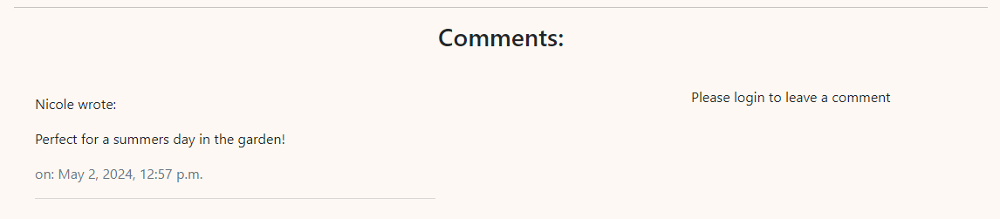
Logged in User
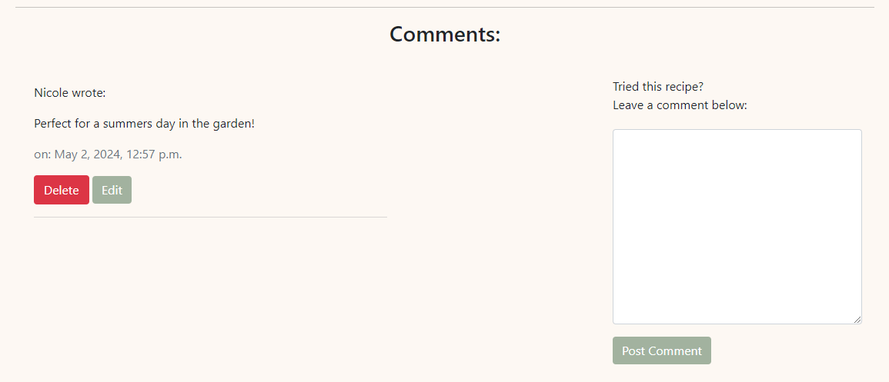

- As a visitor of the page, comments are visible to follow.
- As a logged in user, comments are visible and the "leave a comment" box becomes available.
- If the logged in user is the author of a comment, they will have the option to edit or delete the comment. 
- Confirmation to delete a comment will be prompted to the user.
- Success messages are prompted on posting, editing and deleting a comment.

 Sign Up Page

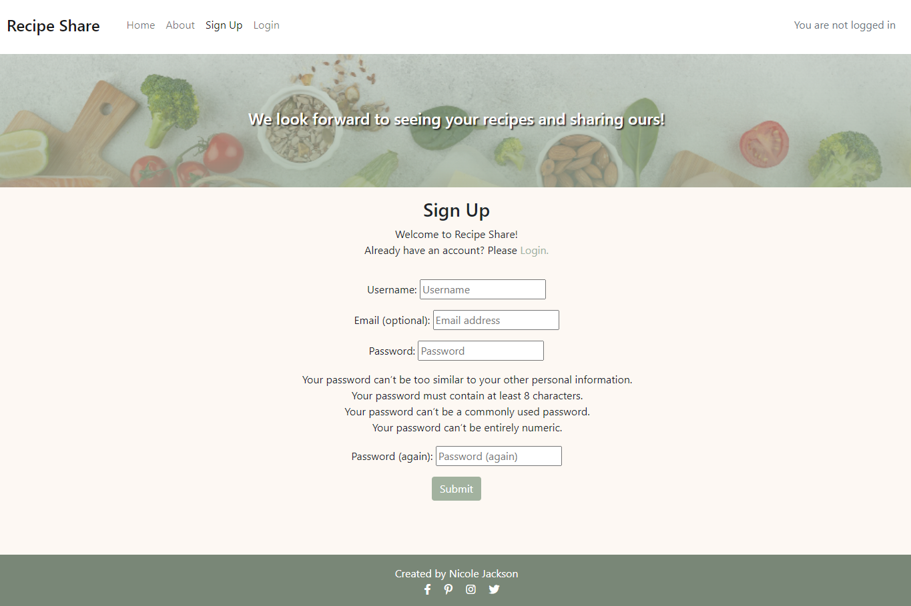

- As a visitor of the page, a sign up is available to register as a site user and enables recipe adding, likes and commenting on recipe posts.
- The visitor needs to add a username, email as optional a password and then a confirmation password. 
- After submission of the form the user will be prompted of a successful signing in of the newly created user and directed to the home page where all features become visible.
- For users who have a login already a link is visible for ease of navigation to the correct page.

 Sign In Page

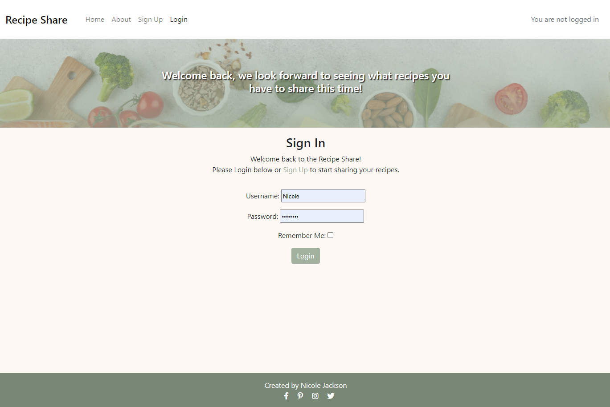

- As a registered site user, a sign in page is available where they can enter using their username and password.
- Once logged in the user will be prompted of a successful signing in and redirected to the home page.
- For users who do not have a login already a link is visible for ease of navigation to the correct page.

 Sign Out Page

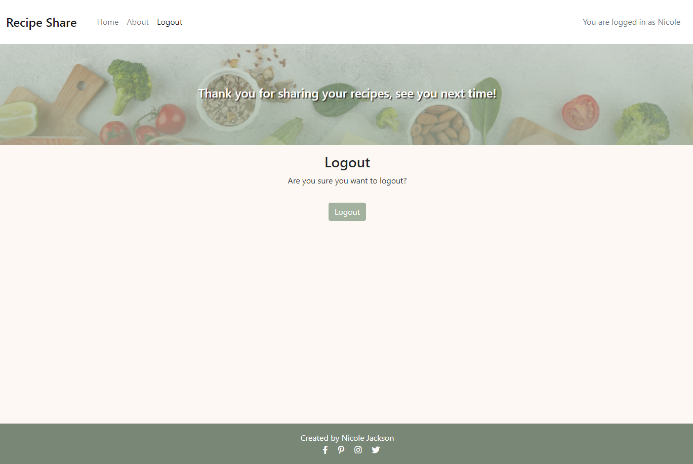

- As a logged in user, a logout page is available where they can successfully logout of the webpage.
- Once logged out the user will be prompted of a successful signing out and redirected to the home page.

 Delete Confirmation on Recipes

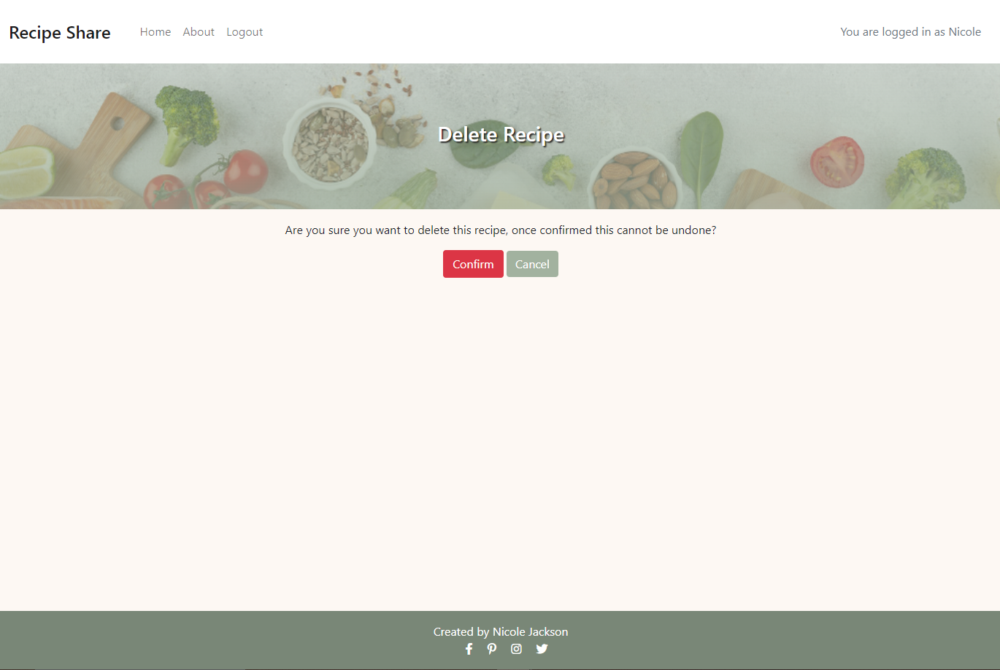

- As a logged in user amd the author of a recipe, you will have the option to delete a recipe post.
- Once delet has been clicked a notification will be prompted to confirm this action.

 Footer

- The footer gives the webpage information / copyright to the users / visitors of the site and links to social media pages.

 Error Pages

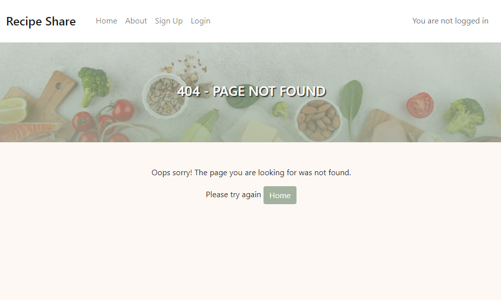
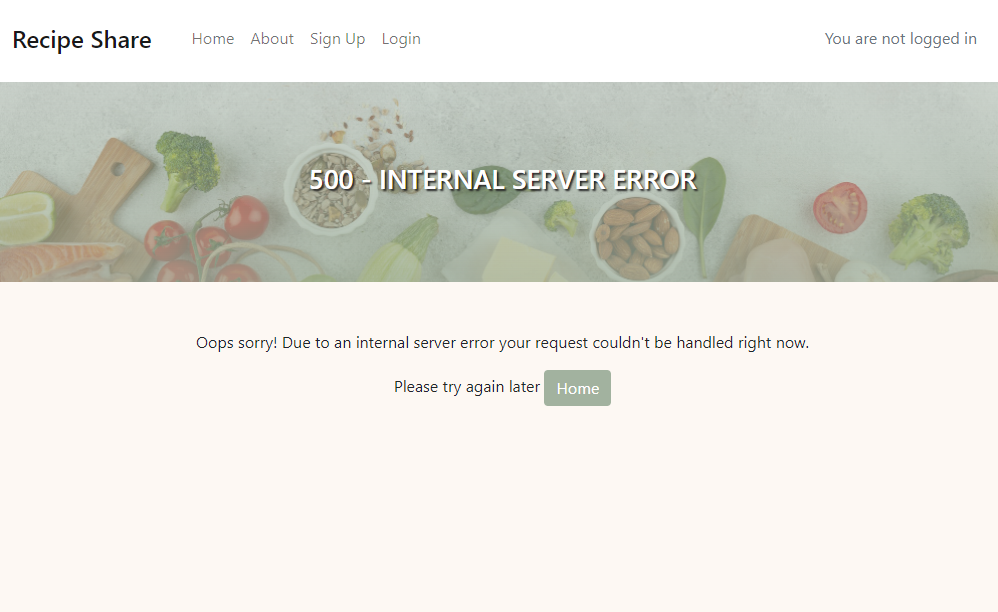

- Custom 404 & 500 error pages were created.
- Buttons to redirect the user / visitor back to the home page were implemented.

 Notifications

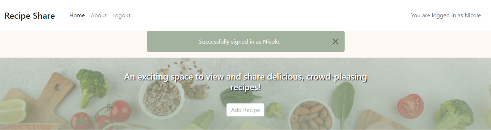

- Notifications are prompted at the top of the webpage for all actions the user reacts with.
- A close button is available if the user wishes to dismiss the notifications.

 Delete Modal on Comments 

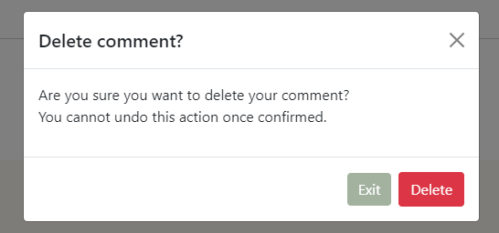

- A delete modal has been implement to prompt the user when they choose to delete a comment they created to prevent accidental deletion.

### Future Features / Features left to implement

- My Profile: 
    - Allows logged in users to edit, update and delete their profile information. 
    - Full name, email, contact number, about fields will be available.
- Search, filter bars:
    - Search allows visitors and logged in users to search the webpage by keywords relating to ingredients, author, recipe title and ratings.
    - Filter allows visitors and logged in users to filter recipes by servings, ratings and author
- Separate Contact page: 
    - Easier navigation as it would be more obvious on how to contact the webpage owners rather than being located in the about page.
- Star ratings:
    - These will be implemented in the comment section below the recipe details where logged in users can rate a recipe if they wish to do so.
- Report: 
    - This will be implemented on both the recipe posts as well as the comments, allowing other users to report inappropriate recipes / comments posted in the webpage.
- Delete Modal on recipe posts:
    - A better pop up notification for prompting a delete confirmation to match the comment delete prompt.
- For the purpose of this project the implementation of these were not yet necessary.

## Testing
See [TESTING.md](https://github.com/NicoleJackson89/pp4-recipe-share/blob/main/TESTING.md) for all the detailed testing

## Deployment

### Cloning the [GitHub](https://github.com/) repository

Cloning a repository will download a full copy of the data to your computer. This is useful when larger commits need to be pushed, adding or removing files and fixing merge conflicts.

1. Login to GitHub
2. Click the repository you wish to clone (Top left corner)
3. Click 'Code' which is shown above the list of files in the repository
4. Click the 'Local' tab, copy the HTTPS URL
5. Open Gitpod Workspaces, click 'New Workspace'
6. Paste the copied URL into the space given under 'Repository URL'
7. Click 'Continue' and the local clone will be created.

### Forking the [GitHub](https://github.com/) repository

Forking a GitHub repository will allow you to make a copy of the repository, changes can then be made that will not affect the original repository. This is useful for proposed changes, ideas, fixes to an original repository.

1. Login to GitHub
2. Click the repository you wish to fork (Top left corner)
3. Click the 'Fork' drop-down in the top right-hand corner
4. Then click 'Create a new fork' you will now have a copy to work on.

### [ElephantSQL](https://www.elephantsql.com/) Database

This webpage is using ElephantSQL PostgreSQL

1. Login to ElephantSQL
2. Click Create New Instance to create a new database
3. Provide a name, usually the project name would be used here
4. Select the Free plan
5. Select your closest Region and Data Center
6. Once created, click on the newly created database name 
7. The database URL and Password can be viewed here.

### [Cloudinary](https://cloudinary.com/)

The API platform has been used to store images uploaded by users of the webpage

1. Login to Cloudinary
2. In the Dashboard, you can copy your API Environment Variable
3. Be sure to remove the CLOUDINARY_URL= as part of the API value; this is the key in Config vars.

### [Heroku](https://heroku.com/apps) deployment

1. Login to Heroku
2. On the Heroku dashboard click on 'New'
3. Select 'Create New App'
4. Add an app name and select your region
5. Click 'Create App'

#### Prepare the workspace environment & settings.py

1. Create an env.py, requirements.txt & Procfile in the main directory of your GitPod workspace
2. Add the DATABASE_URL value and your chosen SECRET_KEY value to the env.py
3. Import the env.py file in your settings.py file and add the SECRETKEY and DATABASE_URL file paths
4. Comment the default database configuration out
5. Save files, make migrations and migrate
6. Add the Cloudinary URL to the env.py file
7. Add the Cloudinary libraries to the list of installed apps in settings.py
8. Add the STATIC files settings - the url, storage path, directory path, root path, media url and default file storage path
9. Link the file to the templates directory in Heroku
10. Change the templates directory to TEMPLATES_DIR
11. Add Heroku to the ALLOWED_HOSTS list in settings.py ['app_name.heroku.com', 'localhost']
12. In settings.py ensure DEBUG = False

#### Ensure the following Config Vars are added in Heroku

1. SECRET_KEY - Any Django secret key
2. CLOUDINARY_URL - Your Cloudinary API key
3. PORT = 8000
4. DISABLE_COLLECTSTATIC = 1 - this is temporary, will be removed for the final deployment
5. DATABASE_URL - Your ElephantSQL database URL

#### Heroku to deploy

1. At the top of the page again, click 'Deploy'
2. Click on 'Github' as your deployment method
3. Search the relevant repo and link these
4. Once linked, select 'Automatic deploys from' or 'Manual Deploy' (Manually deployed branches will need re-deploying each time the GitHub repository is updated)
5. The app will now be hosted on Heroku
6. Click 'Open App' to view the deployed site.

## Technologies Used

### Languages Used

- [Python](https://en.wikipedia.org/wiki/Python_(programming_language))
- [JavaScript](https://en.wikipedia.org/wiki/JavaScript)
- [CSS](https://en.wikipedia.org/wiki/CSS)
- [HTML5](https://en.wikipedia.org/wiki/HTML5)

### Databases Used

- [ElephantSQL](https://www.elephantsql.com/)
    - Postgres database
- [Cloudinary](https://cloudinary.com/)
    - Used for online static file storage

### Frameworks Used

- [Bootstrap](https://getbootstrap.com/)
    - CSS Framework
- [Django](https://www.djangoproject.com/)
    - Python Framework

### Programs Used

- [Github](https://github.com/)
    - Online code storage
- [Gitpod](https://www.djangoproject.com/)
    - Used as the development environment
- [Git](https://git-scm.com/)
    - Version Control
- [Heroku](https://dashboard.heroku.com/apps)
    - Used to deploy the site (Cloud based)
- [Balsamiq](https://balsamiq.cloud/)
    - Used to create the wireframes
- [Snipping Tool](https://en.wikipedia.org/wiki/Snipping_Tool)
    - Screenshots for the README.md
- [Snagit](https://www.techsmith.com/screen-capture.html)
    - Capture longer screenshots for the README.md
- [DBDiagram](https://dbdiagram.io/)
    - Used to create the Database diagram
- [Coolers](https://coolors.co/)
    - Used to generate the colors 
- [Am I Responsive](https://ui.dev/amiresponsive?url=https://recipe-share-58fcaea24fd7.herokuapp.com)
    - Used to for the image across devices in the README.md
- [Chrome DevTools](https://developer.chrome.com/docs/devtools)
    - DevTools was used throughout the process of creating the webpage to find bugs and test responsiveness on elements etc
- [Grammarly](https://app.grammarly.com/)
  - Used to check grammar and spelling
- [JSHint](https://jshint.com/)
  - Used to validate the JavaScript code
- [Color Contrast Accessibility Validator](https://color.a11y.com/)
  - Color Contrast Validator was used to test the web pages color contrast
- [W3C Markup Validation](https://validator.w3.org/)
  - W3C validator was used to validate all the HTML code
- [W3C CSS Validation](https://jigsaw.w3.org/css-validator/)
  - W3C validator was used to validate all the CSS code 
- [Free Formatter](https://www.freeformatter.com/)
  - Free formatter was used to format the CSS and HTML code

## Credits
The following documentation, tutorials and guides were used to aid the development process.

- [Font Awesome](https://www.djangoproject.com/)
    - Used for font icons
- [Slack Community](https://app.slack.com/client/T0L30B202/C027C3PLS1W)
    - Slack community for guidance
- [I think therefore I blog](https://learn.codeinstitute.net/courses/course-v1:CodeInstitute+FSD101_WTS+2/courseware/56a2da0940b4411d8a38c2b093a22c60/4565659a34d648b8b8edd063c3182180/)
    - Code Institutes walkthrough project
- [Freepik](https://www.freepik.com)
    - Placeholder images were downloaded from here
- [Hero Image - W3 Schools](https://www.w3schools.com/howto/howto_css_hero_image.asp)
    - Hero image sizing
- [BBC Good Food](https://www.bbcgoodfood.com/)
    - Recipes from BBC Good Food were used in the webpage
 - CRUD & guidance:
    - [Recipe CRUD project using the Django framework + Bootstrap 5](https://medium.com/@devsumitg/recipe-crud-project-using-the-django-framework-bootstrap-5-3160ec5b43aa)
    - [Create a Recipe App in Django - Tutorial](https://dev.to/domvacchiano/create-a-recipe-app-in-django-tutorial-5hh)
    - [Helen Murugan's Project: the-groomers-network](https://github.com/helenmurugan/the-groomers-network/tree/main)
    - [Kim Bergstroem's Project: gamers_insight-CRUD-Blog-App](https://github.com/KimBergstroem/gamers_insight-CRUD-Blog-App/tree/main)
- 404 & 500 Custom error pages
    - [Thomas Tomo's Project: woodland-whispers-retreat](https://github.com/Thomas-Tomo/woodland-whispers-retreat/tree/main)
    - [Stackoverflow](https://stackoverflow.com/questions/35156134/how-to-properly-setup-custom-handler404-in-django)

## Acknowledgements

Thank you to my mentor Mitko Bachvarov for his guidance, advice, support as well as my husband and fellow student Iain Jackson for his advice, motivation, troubleshooting assistance throughout the process of this project.