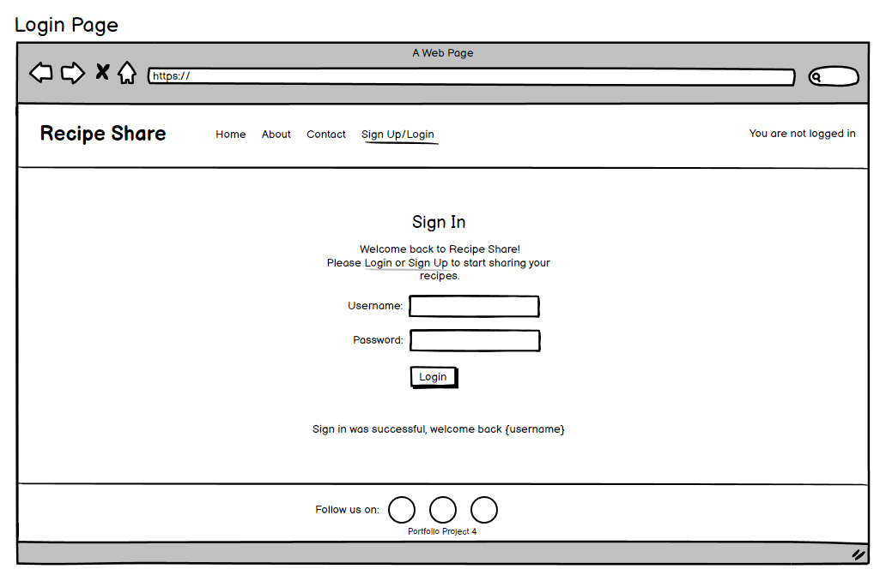
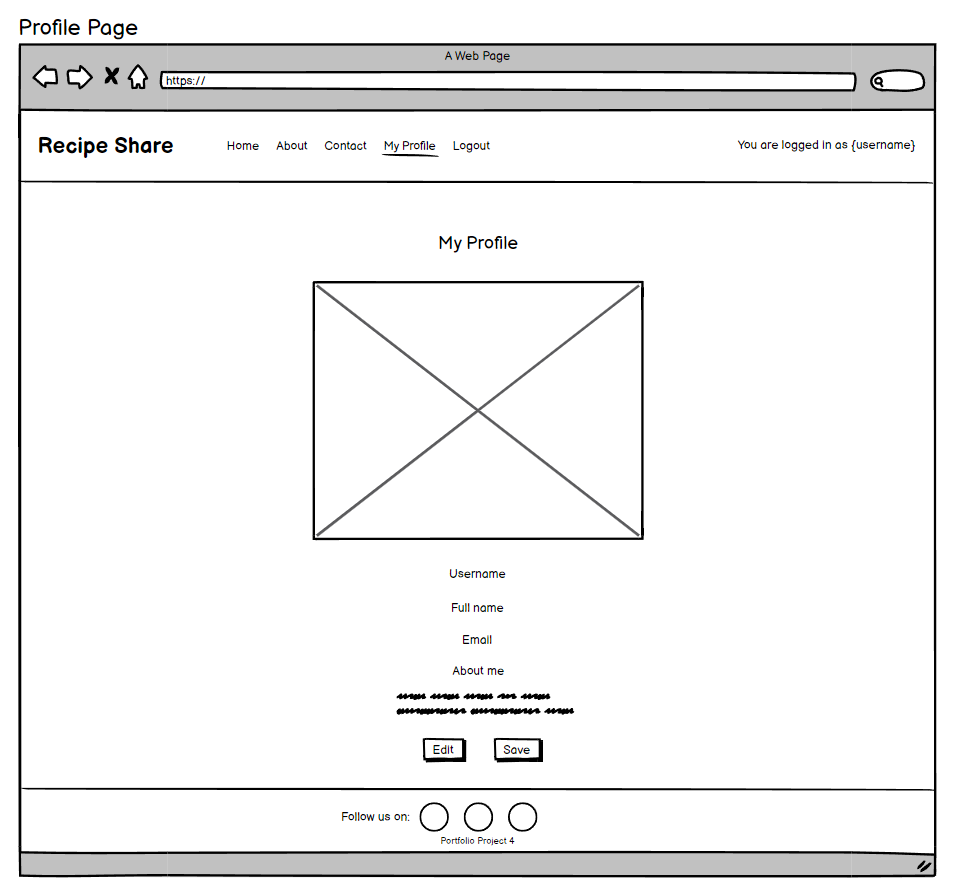

# Recipe Share

### [View the live page here](https://recipe-share-58fcaea24fd7.herokuapp.com/)

Recipe Share is a Django web application created for people who enjoy sharing their most loved recipes and discovering new recipes that other users may have added. The web application offers users the option of creating their own recipes that can be shared on the site, other users may have the option to like and comment on recipe posts and visa versa. Sign up today and start exploring and sharing, discovering and trying recipes to your hearts content.

## User Experience (UX)

### Project Goals
The project goal is to create a user-friendly, responsive web application with seamless navigation to each page and from one recipe post to another as well as user feedback. The webpage allows visitors to explore recipes that have been posted by the site admin as well as other users, read more about the page as well as submit a contact form if they so wish to be contacted or contribute to the webpage in any way. Logged in users will have access to these options as well as the ability to add, update and delete their own recipes and like other recipes posted on the page.

### Agile Methodology
Epics were created to break down and group user stories which were then further broken down into tasks as steps to follow in the building process of the webpage. These were added to Project Boards on Github to assist with better organization and prioritization of the tasks in creating the webpage. 

 User Story Template

 User Story Issues

 Project Board

### User Stories
Detailed view of the [project board](https://github.com/users/NicoleJackson89/projects/3/views/1)
#### Epics:
1. User Experience as a New User / Visitor 
2. User Experience with Comments and Recipe posts
3. User Profile
4. Administration and Content Management

#### User Stories:
1. User Experience as a New User / Visitor 
    - Visually pleasing and easy to understand home page
    - Easy to navigate web page
    - New User account registration
    - Notifications pop-up to the User
2. User Experience with Comments and Recipe posts
    - View paginated list of Recipe posts
    - View Recipe posts
    - Add and manage Recipe posts
    - Comments on Recipes posted
3. User Profile
    - My Profile
    - Other users profiles
4. Administration and Content Management
    - Superuser/Admin control over other user accounts

### Target Audience
Recipe Share is designed for food lovers who:
- Enjoy sharing their cooking experiences
- Interested in exploring new recipe ideas
- Seek to network with others who have uploaded recipes
- First time cooks or people who prefer a guided cooking experience

### As a first time visitor
- Quickly and easily understand what the webpage is about.
- Navigate the main menu and options available easily.
- Informative content and easy to follow navigation between pages.
- Easily sign up to allow sharing of my own recipes and commenting on other recipe posts.
- Get notifications for actions performed throughout the page.
- Other users comments are visible to all users of the site.

### As a returning / logged in user
- Easily navigate through the webpage and recipe posts from the home page.
- Add a recipe post with easy, also the benefit of customization of text on some fields when adding a recipe.
- Recipes show likes on the home page as well as a short description of what the recipe is entails.
- Recipes are well laid out for easy understanding on the detail view as well as the adding a recipe view.
- Users can edit and delete recipes they have posted.
- Notifications are made visible when changes are successful.
- Users can comment on posts, edit and delete is also available if the comment was created by them.
- Other users comments are visible to all users of the site.

### As an admin user
- There is a secure login separate from the main webpage for administrators.
- Admin users have full CRUD on the about page, contact requests are made visible here too.
- User accounts can be accessed, edited and deleted here.
- Full CRUD is available on the recipe posts and comments to the admin.

## Design (UX)
Recipe Share was designed to have a welcoming easy to navigate and understand layout. Natural earthy colors were used to allow the recipe post images to stand out to invite the users. Nine recipe posts were made available on each page with the option to add a recipe to logged in users on the hero image on the home page. Social media links are available to each page for users to be redirected if they wished to see more about the Recipe Share webpage.

### Color Scheme

### Wireframes

 Home Page as a Guest / Visitor

 Home Page as a Logged in User

 Sign Up Page

 Login Page

 About Page

 Contact Page

 Profile Page

 Logout Page

 Recipe Detail Page

 Add Recipe Page

### Database Models

1. AllAuth User Model
    - The Django built AllAuth is used as a default User model and provides user authentication.
    - Pre-defined fields of username, email and password are used.
    - The User is a one-to-many relationship with the Recipe model. 
2. Recipe Model
    - The Recipe model was created for visitors to view recipes and logged in users to add a recipe to the webpage, with a one-to-many relationship as one user can add many recipes to the webpage.
    - Fields a user may have access to when adding a recipe are: title, excerpt, featured image, prep & cook time, servings, ingredients, instructions and notes.
    - Automatic fields are: slug which is populated by the title, author which is related to the logged in user, created & updated on.
    - The likes field, a many-to-many relationship was an addition to allow users to like a recipe which is made visible to other users below each recipe as well as on the home page.
3. Comment Model
    - The Comment Model was created for logged in users to post a comment if they wish on a recipe, with a many-to-one relationship as many comments can be posted on one recipe.
    

## Features

### Existing Features

- Main screen

    

    

    

- Game display:

    

- Correct guess:

    

- Incorrect guess:

    

- Errors on guess:

    

    

    - This updates as the user guesses a new letter:

    

- Play again:

    

### Future Features

## Flowchart

## Testing

### CI Python Linter

Functions were tested using [CI Python linter](https://pep8ci.herokuapp.com/) throughout the building process, making the final testing stage simpler and a smoother process.

### Manual Testing

|What was tested|Result|
|---|---|
||Passed|
||Passed|
||Passed|
||Passed|
||Passed|
||Passed|
||Passed|
||Passed|

### Fixed bugs

|What was tested / Expected results|Actual Results|What was done to fix the bug|
|---|---|---|
||||
||||
||||

## Deployment

### [Heroku](https://heroku.com/apps) deployment

1. Login to Heroku
2. On the Heroku dashboard click on 'New'
3. Select 'Create New App'
4. Add an app name and select your region
5. Click 'Create App'
6. On the next page at the top click 'Settings' then 'Config Vars'
7. Click 'Reveal Config Vars' then add 'Port' key and value '8000' (Optional)
8. Scroll down and click 'Buildpack'
9. 'Add', 'Python' & 'Node.js' with Python being first (above) Node.js
10. At the top of the page again, click 'Deploy'
11. Click on 'Github' as your deployment method
12. Search the relevant repo and link these
13. Once linked, select 'Automatic deploys from' or 'Manual Deploy'
14. The app will now be hosted on Heroku.

### Cloning the GitHub repository

Cloning a repository will download a full copy of the data to your computer. This is useful when larger commits need to be pushed, adding or removing files and fixing merge conflicts.

1. Login to GitHub
2. Click the repository you wish to clone (Top left corner)
3. Click 'Code' which is shown above the list of files in the repository
4. Click the 'Local' tab, copy the HTTPS URL
5. Open Codeanywhere, click 'New Workspace'
6. Paste the copied URL into the space given under 'Repository URL'
7. Click 'Create' and the local clone will be created.

### Forking the GitHub repository

Forking a GitHub repository will allow you to make a copy of the repository, changes can then be made that will not affect the original repository. This is useful for proposed changes, ideas, fixes to an original repository.

1. Login to GitHub
2. Click the repository you wish to fork (Top left corner)
3. Click the 'Fork' drop-down in the top right-hand corner
4. Then click 'Create a new fork' you will now have a copy to work on.

## Technologies, Libraries, Frameworks & Programs Used

- [Python](https://en.wikipedia.org/wiki/Python_(programming_language))
    - Python was used to structure the content of the app
- [GitHub](https://github.com/)
    - GitHub is being used to store the code for this web page
- [Gitpod](https://gitpod.io/)
    - Gitpod was used as the development environment for this web page
- [CI Python Linter](https://pep8ci.herokuapp.com/)
    - Used to validate the code and functions
- [Heroku](https://heroku.com/apps)
    - Used to deploy the app
- [Am I Responsive?](https://ui.dev/amiresponsive)
    - Used to for the image in the README file
- [DB Diagram](https://dbdiagram.io/)
    - Used to for the image in the README file

## Credits

- Slack community for guidance:
  - [Slack Community](https://app.slack.com/client/T0L30B202/C027C3PLS1W)

## Acknowledgements

Thank you to my mentor Mitko Bachvarov for his guidance, advice, support as well as my husband and fellow student Iain Jackson for his advice, motivation, troubleshooting assistance throughout the process of this project.