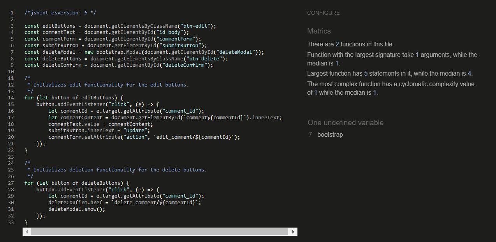

# Recipe Share | Testing

Back to the [README.md](https://github.com/NicoleJackson89/pp4-recipe-share/blob/main/TESTING.md)

Comprehensive manual testing has been performed throughout the development of this webpage to ensure the seamless and optimal functionality of all features.

## Manual Testing

### As a visitor

| What was tested | Expected Result | Outcome |
|:---|:---|:---:|
| Click to open links on Nav bar | Redirect to each page | Passed |
| Click on the Logo on the nav bar | Redirect to the home page | Passed|
| Click on the Sign Up, Login, Logout on the nav bar | Redirect to the relevant pages | Passed |
| Click on a Recipe | Redirect to the Recipe detail | Passed |
| Click on the "like" button | No action should take place | Passed |
| Click on the "next" or "back" buttons below the recipe posts | Redirect to the next/prev page | Passed |
| Click on the social media links in the footer | Redirects to the relevant social media page in a new tab | Passed |
| Click on Sign-Up & enter relevant info | Notification of being signed in and the new username created | Passed |

### As a logged in User 

| What was tested | Expected Result | Outcome |
|:---|:---|:---:|
| Click on the "Add Recipe" button | Redirect to the add a recipe detail page | Passed |
| Click on the cancel button on the create a recipe detail page | Redirect to the Home page | Passed |
| Populated all the fields in the add a recipe detail page, click on the submit button| User is redirected to the recipe detail which was just created | Passed |
| Click on the "like" button | Add 1 to the number of like and the heart turns red or back to grey if the recipe was already liked | Passed |
| Click on the edit button in a recipe post that belongs to the logged in user | The user is able to edit the recipe post | Passed |
| Click on the delete button in a recipe post that belongs to the logged in user | The user is redirected to a delete confirmation page, the post is deleted if confirmed | Passed |
| Populate the comment text area and click the "post comment" button | Creates a comment below the recipe detail | Passed |
| Click on the delete button on the comments that belongs to the logged in user | The user is redirected to a delete confirmation page, the post is deleted if confirmed | Passed |
| Click on the edit button on the comments that belongs to the logged in user | The comment can be edited | Passed |
| Populate the contact form on the about page and clicked the submit button | Submits successfully and notifies the user | Passed |
| Click logout in the nav bar | Logout is successful and user is redirected to the Home page | Passed |

### As a logged in User 

| What was tested | Expected Result | Outcome |
|:---|:---|:---:|
| A user/visitor not being logged in | Notification in the nav bar when "you are not logged in" on the home page | Passed |
| Logout | Notification: "You have signed out." | Passed |
| Login | Notification: "Successfully signed in as {username}." | Passed |
| Sign-up | Notification: "Successfully signed in as {username}." | Passed |
| Recipe post created & submitted | Notification: "Your recipe has been posted!" | Passed |
| Recipe post edited & submitted | Notification: "Your recipe has been updated successfully!" | Passed |
| Post a comment | Notification: "Comment was posted successfully!" | Passed |
| Update a comment | Notification: "Your comment has been successfully updated!" | Passed |
| Delete a comment confirmation | Notification: "Are you sure you want to delete your comment? You cannot undo this action once confirmed." | Passed |
| Delete a comment | Notification: "Your comment has been deleted!" | Passed |
| Delete a Recipe confirmation | Notification: "Are you sure you want to delete this recipe, once confirmed this cannot be undone?" | Passed |
| Delete a Recipe | Notification: "Your recipe has been deleted!" | Passed |
| Contact form submitted | Notification: "Contact request received! We endeavour to respond within 24 hours." | Passed |
| Appending a page url to the search bar that does not exist Appending a page url to the search bar that does not exist  | Redirect to 404 - PAGE NOT FOUND | Passed |

### Layout and built in functionality

| What was tested | Expected Result | Outcome |
|:---|:---|:---:|
| Recipe posts | Views as newest recipes to oldest on the home page | Passed |
| Time stamps on recipes and comments | Views the time a post or comment is created | Passed |
| "Like" icon on home page | "Like" icon and count updates on home page | Passed |
| Comment counter | Displays the correct number of comments | Passed |
| Author banner on the recipe post | Displays the correct author | Passed |
| Recipe titles cannot be duplicated | A recipe wont allow posting if another one exist with the same title | Passed |

### Chrome Developer Tools

Chrome developer tools were used throughout the development of the webpage to test responsiveness. Responsiveness was tested using developer Tools to emulate the following devices:
- Desktop 
- Laptops
- Tablets
- Mobile phones

### Browser Testing

During the development of the webpage the testing was done using Google Chrome. In production the site has been tested on the following browsers:
- Google Chrome
- Microsoft Edge
- Mozilla Firefox
- Opera

## Validation

### [W3C HTML Validator](https://validator.w3.org/)

Some html pages do contain comments for ease of navigation through sections

 First html validator test - FIXED

- Error: Element p not allowed as child of element span - Fixed

 Second html validator test

- No errors and no warnings were found on the second test

### [W3C CSS Validator](https://jigsaw.w3.org/css-validator/)

 CSS validator test

- No errors were found but warnings due to webkits are noted

### [JSHint JavaScript Validator](https://jshint.com/)

 JSHint JavaScript Validator

- No errors were found

### [CI Python Linter](https://jshint.com/)

 CI Python Linter

- All Python files were tested, no errors or warnings were found. An example on the views.py file can be seen.

## Fixed Bugs

1. Slug field was added to the Recipe model after the model was created however it was creating errors. The fix was to provide a default value of null.
2. Text fields for the parts Recipe post form however they did not allow for user editing, summernote was added to create a better user experience when adding recipe ingredients & Instructions
3. The summernote editors were not responsive on smaller devices credits to my husband and fellow student who found a way to customise summernote editor in the settings.py file.
4. Other bugs were minor spacing and colour matching of buttons, layouts etc that had been fixed.
5. Summernote in the admin panel on some fields had disappeared after adding summernote configuration to settings.py. The fix was done by removing the iframes=false config.

## Known / Unresolved Bugs

1. The Recipe posts on the home page are slightly big on the desktop view, so I have considered adding more recipes to the first page to give it a more squashed view. 
2. Comments get duplicated if a user refreshes their web page after posting a comment on a recipe post.
3. List style on Recipe posts ingredients looks great with the bullet point in more views however does not work well when using devices 500px and smaller.
4. The recipe post image, excerpt, cook & prep time and serves fields are not fitting to my liking on mobile screen sizes. This will be fixed after some research and changes have been done.

Back to the [README.md](https://github.com/NicoleJackson89/pp4-recipe-share/blob/main/TESTING.md)
